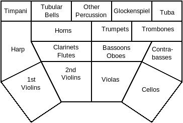

# Virtual Playing Orchestra Template

## What is this?
This is an Ardour template for composing orchestral music, using only no-cost virtual instruments and LV2 plugins.

## License

[Creative Commons Attribution-ShareAlike 4.0](https://creativecommons.org/licenses/by-sa/4.0/)

## Requirements
This template has been tested with:
* 8GB memory
* Quad-core i5 3GHz CPU

The system monitor reports Ardour using less than 2GB of memory and only moderate CPU usage with a rather full orchestral score, so it will probably work with 4GB of memory and a much less powerful CPU.

### Assumptions

* Knowledge of how to use Ardour
* Understanding of terminal and filesystem

### Software 

* [Ardour 5.12+](http://ardour.org/)
* [sfizz](https://sfz.tools/sfizz/)
* [Dragonfly Reverb](https://github.com/michaelwillis/dragonfly-reverb)
* [Virtual Playing Orchestra 3](http://virtualplaying.com/)

Download and compile [sfizz development branch](https://github.com/sfztools/sfizz/tree/develop).

Download [Dragonfly Reverb](https://github.com/michaelwillis/dragonfly-reverb/releases/tag/2.0.0) and extract it.

Install both sfizz and Dragonfly Reverb in a place where Ardour will find LV2 plugins.

Download [Virtual Playing Orchestra](http://virtualplaying.com/), you will need the Wave Files and the Performance Orchestra SFZ Scripts. Extract both to `/opt`:

```
sudo unzip $HOME/Downloads/Virtual-Playing-Orchestra3-1-wave-files.zip -d /opt/
sudo unzip $HOME/Downloads/Virtual-Playing-Orchestra3-2-performance-scripts.zip -d /opt/
```

Download [virtual-playing-orchestra-template-2.0.0-RC2.zip](https://github.com/michaelwillis/virtual-playing-orchestra-ardour-template/releases/download/2.0.0-RC2/virtual-playing-orchestra-template-2.0.0-RC2.zip)

On Linux, extract to `$HOME/.config/ardour5/templates`:

```
unzip $HOME/Downloads/virtual-playing-orchestra-template-2.0.0-RC2.zip -d $HOME/.config/ardour5/templates/
```

On MacOS, extract to `$HOME/Library/Preferences/Ardour5/templates/`:
```
unzip $HOME/Downloads/virtual-playing-orchestra-template-2.0.0-RC2.zip -d $HOME/Library/Preferences/Ardour5/templates/
```

## Using the template

Create a new Ardour session, selecting the template `Virtual Playing Orchestra`.

Use of Ardour's `MIDI input follows MIDI track selection` feature is suggested. In `Preferences`, `MIDI`, `Ports`, tick the box for that feature. Also tick `Music Data`, `Control Data`, and `Follow Selection` for your midi Input. As an example, to play a tuba part, select the `Tuba` track and play bass keys on your midi keyboard; you should hear the tuba. To record, arm the Tuba track, click the record button and then the play button, and then play the part.

This template uses the "Performance" SFZ files for wind and string instruments, which means that the mod wheel (CC1) controls the dynamics, and velocity controls the articulation (higher velocities tend to have a harder "attack", lower velocities tend to come in more gently). 

### Seating

Each section and solo part is given distinct stage presence with a more or less traditional seating arrangement:



### Stage Presence

Panning and stereo width are set on each track. Every track has a send to one of three busses called "Front Reverb", "Middle Reverb", and "Back Reverb", each configured to give the sound corresponding stage depth.

### Questions and Answers

**Shouldn't this section be called `FAQ`?**

No it shouldn't. I wrote up this section before people could start asking questions.

**Why does this template use the "Performance" SFZ files instead of the "Standard" ones?**

I like the elegance of having dynamics primarily controlled by a single parameter. The alternative of using a combination of channel volume, expression, and velocity to control dynamics gets confusing.

**Why do all of the wind tracks use solo samples?**

I liked the sound of the solo wind samples more than the sections, and found that harmonizing duets or trios on the same track sounds enough like a section.

**Why didn't you include all of the instruments available from Virtual Playing Orchestra?**

This was done for simplicity's sake. Everybody will have different opinions about which specific instruments they want to use. Consider the template to be a place to start, customize it how you want and save your own template.

**Why isn't there a piano?**

People are very opinionated about which sampled piano they want to use, and Virtual Playing Orchestra does not include one for that very reason. Pick your preference of piano and use it.
